# CC_Muacca-Mini

## これは何？

- [カスタムキャスト](http://customcast.jp/) で作成したキャラクターのパラメータを整理して記載したものです。
- VRMエクスポート機能は実装されていますが、有料かつ１体のみという制限があります。なので、参考情報として設定情報を公開しています。
- カスタムキャストを使って、ここに記載のパラメータ通りにキャラクターをカスタマイズすると、同じ見た目のキャラクターを再現できる、はずです。

## 何の役に立つの？

- 基本的に何の役にも立ちません。
- 自作のキャラクターのパラメータを公開する際、パラメータの書き方を参考にしてもらえればと思ってこのページを作成しました。

----

## キャラクター設定

|属性|内容|
|:---|:---|
|名前|Muacca Mini|
|よみがな|むあっか　みに|

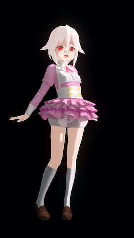

## サンプルイメージ

（画像サイズ大きめなので表示時には注意ください）

- [サンプル１](sample/MuaccaMini_001.png) 
- [サンプル２](sample/MuaccaMini_002.png) 
- [サンプル３](sample/MuaccaMini_003.png) 
- [サンプル４](sample/MuaccaMini_004.png) 
- [サンプル５](sample/MuaccaMini_005.png) 

----

## ボディ設定

### ボディパーツ

|パーツ|パーツ名|サイズ|課金|
|:---|:---|---:|:---:|
|ボディ  |ボディA|-|Free|
|フェイス|プリティフェイス・ノーマル|-|Free|
|肌     |通常肌|-|Free|
|前髪    |サイドシャープ|100, 0|課金|
|後髪    |シンプルショートバック|0|Free|
|もみあげ|-|-|-|
|テール  |-|-|-|
|アホ毛  |ロングカーブ|1.50|Free|
|眉毛    |下がりまゆ|-|Free|
|瞳      |ダイヤアイリス|-|Free|
|ハイライト|オーバー|-|Free|
|ほくろ  |-|-|-|
|タトゥー|-|-|-|
|ネイル  |グラデーションネイル・薄橙|-|Free|
|リップ  |グロス|-|Free|
|キバ    |-|-|-|

### ボディパラメータ

|パラメータ|値|
|:---|---:|
|顔の輪郭    |78|
|顔の横幅    |98|
|顔の縦幅    |100|
|眉の上下    |0|
|目の横幅    |96|
|目の縦幅    |100|
|目の横移動  |23|
|目の縦移動  |0|
|目の閉じ具合|7|
|眼球の上下  |43|
|眼球の横幅  |96|
|眼球の縦幅  |40|
|身長       |0|
|足の長さ    |74|
|胸のサイズ  |9|
|胸のたれ具合|0|
|胸上下      |81|
|胸寄り      |27|
|ウェスト    |69|
|お腹        |51|
|首の長さ    |80|
|肩幅        |26|
|腕の太さ    |5|
|腕の長さ    |100|
|ヒップ      |87|
|足の太さ    |18|
|足の太さ２  |0|

----

## ドレス設定

### ドレスパーツ

|パーツ|パーツ名|色|サイズ|課金|
|:---|:---|:---|---:|:---:|
|帽子      |-|-|-|-|
|ヘッドセット|-|-|-|-|
|上半身    |スイーツカフェトップス|桃|-|Free|
|下半身    |かぼちゃフリルパンツ|ノーマル|-|Free|
|ワンピース|-|-|-|-|
|水着      |-|-|-|-|
|靴下      |スクールソックス|白|-|Free|
|靴        |ローファー|ノーマル|-|Free|
|髪飾り    |-|-|-|-|
|メガネ    |ふちなしメガネ|ノーマル|1.18Free|
|アイマスク|-|-|-|-|
|鼻飾り    |-|-|-|-|
|耳飾り    |-|-|-|-|
|手袋      |-|-|-|-|
|首飾り    |-|-|-|-|
|首輪      |-|-|-|-|
|髪留め    |-|-|-|-|
|腕飾り    |-|-|-|-|
|腹飾り    |-|-|-|-|
|足飾り    |-|-|-|-|
|尻尾      |-|-|-|-|
|翼        |-|-|-|-|

----

## カラー設定

### 肌カラー

#### 基本色

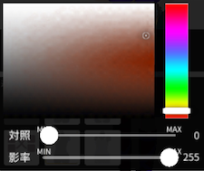

|パラメータ|値|
|:---|---:|
|対照|0|
|影率|255|

#### 影色

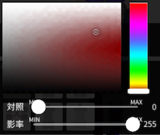

|パラメータ|値|
|:---|---:|
|対照|0|
|影率|255|

#### 境界色

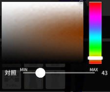

|パラメータ|値|
|:---|---:|
|対照|43|

### 髪カラー

#### 基本色

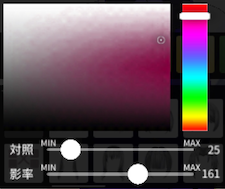

|パラメータ|値|
|:---|---:|
|対照|25|
|影率|161|

#### 影色

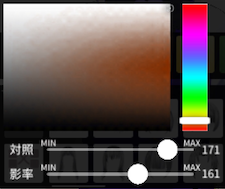

|パラメータ|値|
|:---|---:|
|対照|171|
|影率|161|

#### 境界色

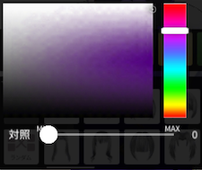

|パラメータ|値|
|:---|---:|
|対照|0|

### 眉カラー

#### 基本色

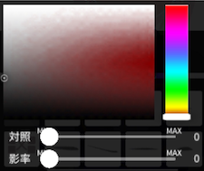

|パラメータ|値|
|:---|---:|
|対照|0|
|影率|0|

#### 影色

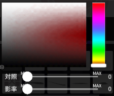

|パラメータ|値|
|:---|---:|
|対照|0|
|影率|0|

### 瞳カラー

#### 基本色

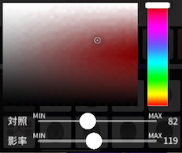

|パラメータ|値|
|:---|---:|
|対照|82|
|影率|119|

#### 影色

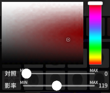

|パラメータ|値|
|:---|---:|
|対照|0|
|影率|119|

enjoy!

----

- 『カスタムキャスト』は株式会社ドワンゴの登録商標です。

